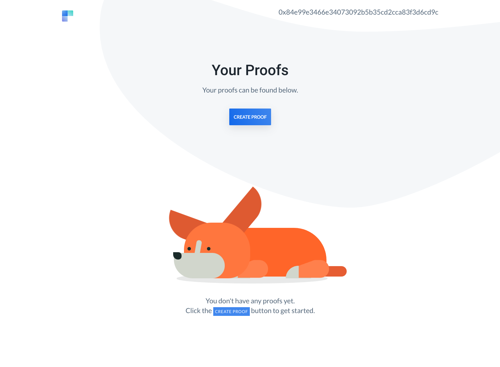
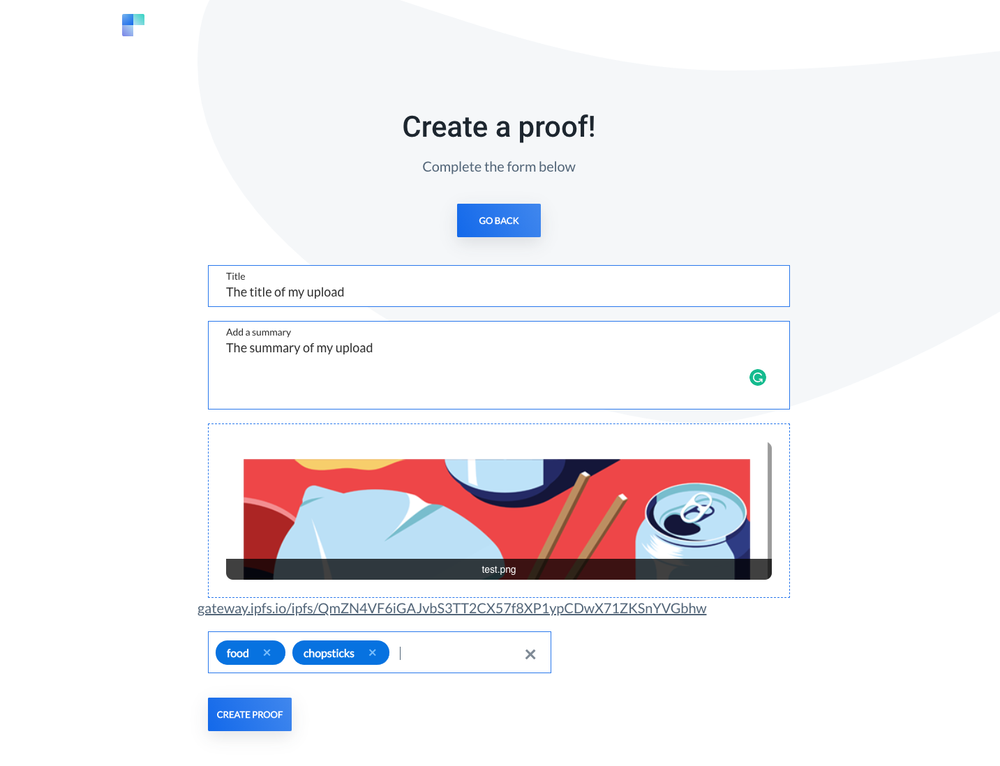
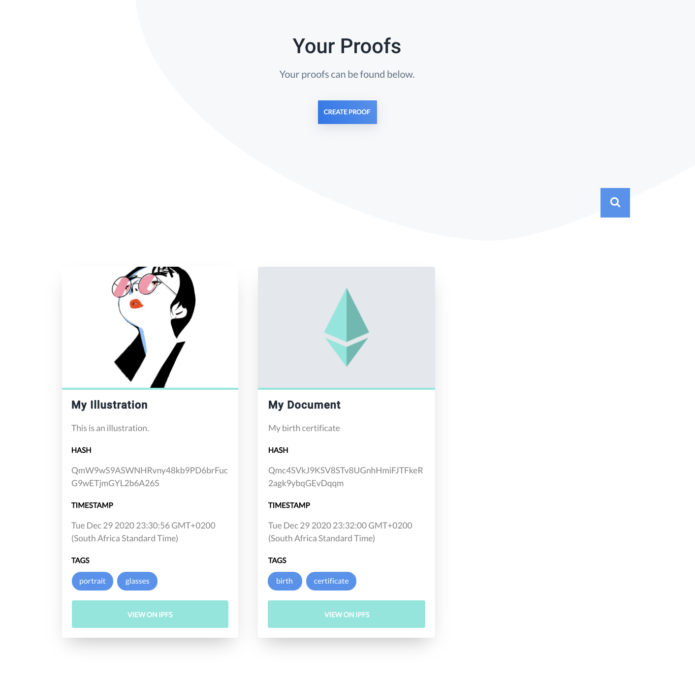

# Proof of Existence
######  An Ethereum-based decentralized application

----

### Table of contents
1. [What is Proof of Existence?](#introduction)
2. [Technical Requirements](#tech)
3. [Testing Instructions](#test)
4. [Developer Instructions](#dev)
    - [Ganache Listener](#ganache)
    - [Web Installation](#web)
    - [Contract Deployment](#contract)
    - [Running Instructions](#run)
5. [UI Instructions](#ui)

----

#### What is Proof of Existence and how does it work? <a name="introduction"></a>
The Proof of Existence dApp allows users to verify the existence of a document by uploading it via the dApp UI and storing it on the blockchain. The upload is stored on an [Infura](https://infura.io/) IPFS (Inter-Planetary File System — a decentralized file storage network) and its IPFS reference hash and its corresponding details (Title, Summary, Tags) is stored immutably on the blockchain.

[Link to demo]()

#### Technical Requirements <a name="tech"></a>

Ensure that you have the following installed to run the dApp locally:
  - Node.js (v12.0.0)
  - Truffle (v5.1.57)
  - Ganache-cli (v6.12.1)
    - ganache-core: 2.13.1
    - listens on 127.0.0.1:8545
  - MetaMask
    - Chrome extension

#### Testing Instructions <a name="test"></a>
Within the root directory, run

```
truffle compile --all
truffle migrate --reset
truffle test
```


#### Developer Instructions <a name="dev"></a>

###### Ganache Listener <a name="ganache"></a>

Within a separate terminal tab, run

```
ganache-cli
```

###### Web Installation <a name="web"></a>

Within the root directory and in a new terminal tab, run

```
npm install
```

###### Contract Deployment <a name="contract"></a>
 
Run the following commands in your terminal

```
truffle compile --all
truffle migrate --reset
```

###### Running Instructions (Lite server) <a name="run"></a>

After doing the web installation and contract deployment, run the below within the root directory:

```
npm run dev
```
The browser should open a new tab on http://localhost:3000/. You will need to connect your MetaMask to the dApp by changing the network to `Localhost 8545` and using the seed phrase generated when `ganache-cli` has been executed in your terminal. You will then be asked to select the accounts you wish to have access to the dApp. Once connected, follow the UI instructions below.


#### UI Instructions <a name="ui"></a>

Once the dApp is launched, you will be directed to the landing page which will enable you to log in by clicking on the `GET STARTED` button. 

MetaMask will prompt you to accept the transaction. Once the request has been approved you'll be redirected to your dashboard – where all your proofs will be displayed.If you don't have any proofs, you will be welcomed by this furry friend:



To upload a proof, click on the `CREATE PROOF` button. You will asked to complete fields related to your document. 



Once the file has been uploaded and the hash from the IPFS has been generated, click `CREATE PROOF` to complete the action. MetaMask will as you to confirm the transaction. A success notification will appear at the top of the screen and redirect you to your dashboard. After a few seconds, your dashboard should be populated with your new proof. 




A summary of the proof will be displayed in a card format, as seen below. The document can be viewed in the IPFS by clicking on the `VIEW ON IPFS` button. The user can also search for a proof via the search button.

The dApp will recognise Account changes and refresh the page to reflect that account holder's uploads and account address at the top of the screen. 

----

Resources:
- [Adapted UI template](https://onepagelove.com/ava)

Author: Lucia Daly
